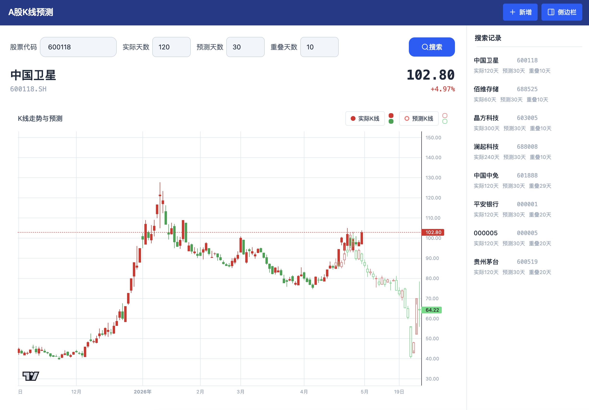

# A股K线预测

基于 Kronos 时序基础模型的 A 股 K 线预测网站。后端使用 FastAPI + Kronos-base 模型推理预测，前端使用 Next.js + lightweight-charts 展示 K 线图表。

## 页面示例



## 功能

- **股票搜索** — 输入股票代码，可自定义实际天数、预测天数、重叠天数
- **K 线走势图** — 展示历史 K 线（红涨绿跌），默认天数由 `config.jsonc` 的 `realDataDays` 配置（默认 120），可在前端搜索框修改
- **K 线预测** — 基于 Kronos-base 模型预测未来 K 线，默认天数由 `config.jsonc` 的 `predOutputDays` 配置（默认 30），空心蜡烛图显示
- **重叠对比** — 实际与预测 K 线重叠天数默认由 `config.jsonc` 的 `overlapDays` 配置（默认 20），重叠区域同时渲染实心与空心蜡烛，直观对比预测准确度
- **图例切换** — 点击图例切换实际/预测 K 线显示，坐标轴保持不变
- **搜索记录** — 侧边栏记录查看历史（含 K 线参数），SSE 实时推送，点击可快速切换

## 技术栈

| 层面     | 选型                              |
| -------- | --------------------------------- |
| 前端框架 | Next.js (App Router) + TypeScript |
| K 线渲染 | lightweight-charts (TradingView)  |
| 样式     | Tailwind CSS v4                   |
| 后端框架 | FastAPI                           |
| 数据源   | akshare（东方财富 + 腾讯备用）    |
| 预测模型 | Kronos-base                       |
| 包管理   | pnpm（前端）+ uv（后端）          |

## 项目结构

```
frontend/             # Next.js 前端
  scripts/            # dev.js（从 config.jsonc 读取端口启动）
  src/app/            # 页面路由
  src/components/     # 组件（NavBar, Sidebar, SearchBox, KLineChart 等）
  src/services/       # API 封装（REST 走 Next.js 代理，SSE 直连后端）
  src/types/          # 类型定义
  next.config.ts      # 从 config.jsonc 读取端口与 K 线默认参数，注入环境变量 + API 代理

server/               # FastAPI 后端
  app/api/            # 路由（stock, history）
  app/services/       # 业务逻辑（predictor, stock_data, search_store）
  app/model/          # Kronos 模型定义（KronosPredictor）
  app/schemas/        # 响应模型（含 SearchHistoryItem 的 K 线参数字段）
  app/config.py       # 全局配置（从 config.jsonc 读取端口与路径）
  scripts/            # run_dev.py, preload_model.py, sync_ports.py
  models/             # 模型权重（git 忽略）
  data/               # 搜索记录（git 忽略）

config.jsonc          # 前后端公共配置（端口 + K 线参数默认值）
```

## 快速开始

### 环境要求

- Python >= 3.10
- Node.js >= 18
- pnpm
- uv

### 后端

```bash
cd server

# 首次部署：预下载 Kronos 模型权重
uv run python scripts/preload_model.py

# 启动服务（端口从 config.jsonc 读取）
uv run scripts/run_dev.py
```

模型权重下载到 `server/models/kronos-model/` 和 `server/models/kronos-tokenizer/`。

### 前端

```bash
cd frontend
pnpm install
pnpm dev    # 运行 node scripts/dev.js，端口从 config.jsonc 读取
```

前端开发服务器默认运行在 `http://localhost:3000`，后端在 `http://localhost:8000`，端口可在 `config.jsonc` 中配置。

### 端口同步

修改 `config.jsonc` 中的端口后，需运行同步脚本更新 `frontend/.env.development`：

```bash
cd server && uv run scripts/sync_ports.py
```

### 配置文件

项目根目录 `config.jsonc` 集中管理前后端公共配置：

| 字段             | 说明                        | 默认值 |
| ---------------- | --------------------------- | ------ |
| `frontend`       | 前端端口                    | 3000   |
| `backend`        | 后端端口                    | 8000   |
| `realDataDays`   | 实际 K 线图天数（默认值）   | 120    |
| `predOutputDays` | 预测 K 线图天数（默认值）   | 30     |
| `overlapDays`    | 实际与预测 K 线重叠天数（默认值） | 20     |

> K 线参数在前端搜索框中可由用户自行调整，`config.jsonc` 中的值为初始默认值。

### 环境变量

| 变量                                | 位置                        | 说明                                                 |
| ----------------------------------- | --------------------------- | ---------------------------------------------------- |
| `NEXT_PUBLIC_SSE_BASE`              | `frontend/.env.development` | SSE 连接地址，开发环境为 `http://localhost:8000/api` |
| `NEXT_PUBLIC_DEFAULT_REAL_DATA_DAYS` | `next.config.ts` 注入       | 实际 K 线默认天数，来源于 `config.jsonc`             |
| `NEXT_PUBLIC_DEFAULT_PRED_OUTPUT_DAYS` | `next.config.ts` 注入    | 预测 K 线默认天数，来源于 `config.jsonc`             |
| `NEXT_PUBLIC_DEFAULT_OVERLAP_DAYS`  | `next.config.ts` 注入      | 重叠天数默认值，来源于 `config.jsonc`               |

## API

| 方法 | 路径                                                        | 说明                     |
| ---- | ----------------------------------------------------------- | ------------------------ |
| GET  | `/api/stock?code=600519&realDataDays=120&predOutputDays=30&overlapDays=20` | 获取 K 线数据 + 预测 |
| GET  | `/api/history`                                              | SSE 搜索记录推送         |

### StockResponse 结构

```typescript
interface StockResponse {
  stock_name: string      // "贵州茅台"
  stock_code: string      // "600519.SH"
  current_price: number   // 1698.00
  price_change: string    // "+2.35%"
  real_data: Ohlcv[]      // 实际行情，长度为 realDataDays
  pred_data: Ohlcv[]      // 预测行情，长度为 predOutputDays
  dates: string[]         // 实际日期 + 预测未来工作日日期（去掉重叠部分）
}

interface Ohlcv {
  open: number
  high: number
  low: number
  close: number
  volume: number
  amount: number
}
```

### SearchHistoryItem 结构

```json
{
  "code": "600519",
  "name": "贵州茅台",
  "time": "2026-05-02T10:30:00",
  "realDataDays": 120,
  "predOutputDays": 30,
  "overlapDays": 20
}
```

## 致谢

- [Kronos](https://github.com/shiyu-coder/Kronos) — 时序基础模型
- [akshare](https://github.com/akfamily/akshare) — A 股数据接口
- [lightweight-charts](https://github.com/tradingview/lightweight-charts) — TradingView 图表库